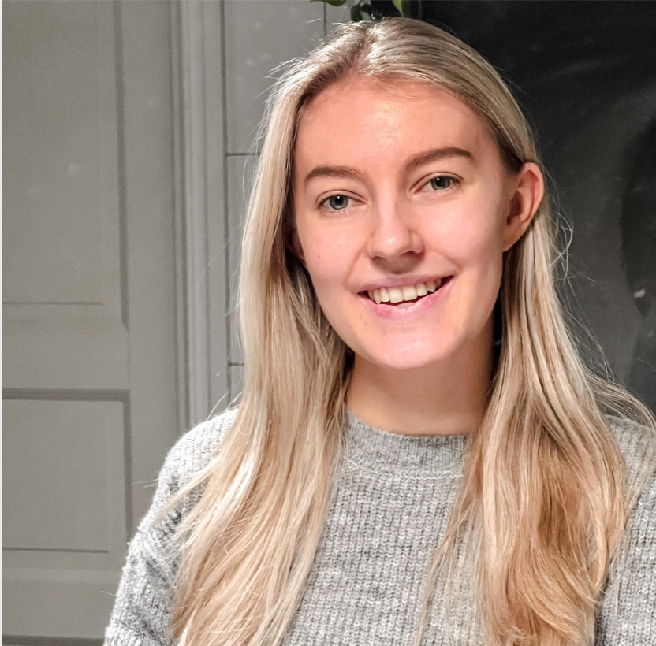

  

    
  

  

    <h2>Om mig</h2>
    

      Här skriver du din Om mig-text.  
      Den här texten kommer att hamna till höger om bilden på större skärmar,
      och automatiskt hamna under bilden på mobil.
    

  

## Utbildning
**Program / Utbildning** – Skola / Universitet  
*År–År*

- Kort beskrivning av utbildningen
- Viktiga kurser eller inriktning

**Gymnasieutbildning** – Skola  
*År–År*

---

## Intressen
- 💻 Programmering och teknik
- 📊 Data och analys
- 🏋️ Träning
- 🎮 Spel
- 📚 Lärande och självutveckling

## CV
📄 [Ladda ner mitt CV](files/cv.pdf)

## Projekt
- [Project 1](projects/project1.pdf)
- [Project 2](projects/project2.pdf)

## Kontakt
- Email: Rebecca.arkhed@telia.com
- GitHub: https://github.com/dittnamn
